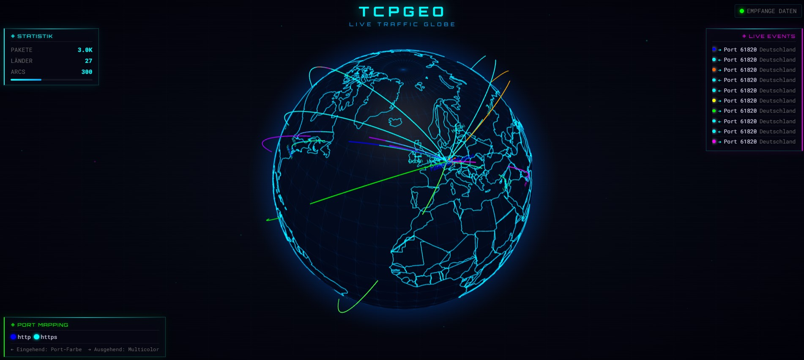

# os-tcpgeo

**OPNsense Live Traffic Globe Plugin**

Real-time network traffic visualization on an interactive 3D globe — fully integrated into the OPNsense web UI.



---

## ✨ Features

- **Cyberpunk 3D Globe** — dark material, neon country borders, animated directional arcs
- **Live Packet Capture** — uses local `tcpdump` on any selectable OPNsense interface
- **GeoIP Resolution** — MaxMind GeoLite2-City with automatic weekly database updates (SHA256-verified)
- **Port-based Arc Colors** — assign a unique color to each port (443 → cyan, 80 → green, …)
- **Direction Detection** — inbound arcs point toward the firewall, outbound arcs are multicolor
- **GPU-rendered Labels** — city/country names appear at arc endpoints on the globe
- **Full OPNsense Integration** — settings page under *Services → TCPGeo*, start/stop/status via configd
- **High-throughput Optimized** — smart backend sampling, zero-DOM-mutation event feed, separated render loops
- **Single-script Install & Uninstall** — no pkg repo required, just `sh install.sh`
- **100% Offline** — Three.js, Globe.gl, Fonts und Geodaten lokal gebündelt (keine CDN-Abhängigkeiten)
- **Security-Hardened** — Privilege Separation (nobody), Basic Auth, WebSocket Rate-Limiting, IP-Masking, XSS-Schutz

---

## 📋 Requirements

| Component | Version |
|-----------|---------|
| OPNsense  | 23.x / 24.x / 25.x |
| Python 3  | ≥ 3.9 (pre-installed on OPNsense) |
| pip       | any (installer auto-detects) |

Python packages installed automatically:

| Package | Purpose |
|---------|---------|
| `aiohttp ≥ 3.9` | Async HTTP + WebSocket server |
| `maxminddb ≥ 2.5` | GeoIP database reader |

> **Note:** No Node.js required. The entire backend runs on Python 3.

---

## 🚀 Installation

### Quick Install (recommended)

SSH into your OPNsense firewall as **root** and run:

```bash
fetch -o /tmp/os-tcpgeo.tar.gz https://github.com/bmetallica/os-tcpgeo/archive/refs/heads/main.tar.gz
tar -xzf /tmp/os-tcpgeo.tar.gz -C /tmp
cd /tmp/os-tcpgeo-main
sh install.sh
```

### With GeoIP Database

To download the MaxMind GeoLite2-City database during installation, pass your license key:

```bash
sh install.sh --with-geoip YOUR_MAXMIND_LICENSE_KEY
```

> Get a free license key at [maxmind.com/en/geolite2/signup](https://www.maxmind.com/en/geolite2/signup).

### From Git (alternative)

```bash
pkg install -y git
cd /tmp
git clone https://github.com/bmetallica/os-tcpgeo.git
cd os-tcpgeo
sh install.sh
```

---

## ⚙️ Configuration

After installation, open the OPNsense web UI:

**Services → TCPGeo**

| Setting | Description | Example |
|---------|-------------|---------|
| Enabled | Enable / disable the service | ✓ |
| Listen Interface | Interface the globe web server binds to | LAN |
| Listen Port | Port for the globe web server | `3333` |
| Capture Interface | Interface to capture packets on | WAN |
| MaxMind License Key | For automatic GeoIP database downloads | `abc123…` || Globe Password | Optional HTTP Basic Auth password (min. 8 chars) | `mySecret1` |
| Mask IPs | Hide last octet of IPs in frontend (e.g. `1.2.3.xxx`) | ✓ (default) || Port Colors | Color mapping per port (table) | `443 → #00ffff` |

Click **Save & Apply** — the service will (re)start automatically.

---

## 🌍 Accessing the Globe

Open a browser and navigate to:

```
http://<YOUR-FIREWALL-IP>:3333
```

Replace `3333` with whatever listen port you configured.

---

## 🗑️ Uninstallation

```bash
sh /usr/local/opnsense/scripts/tcpgeo/uninstall.sh
```

This removes all plugin files. The TCPGeo configuration in `config.xml` is left intact and cleaned up automatically on the next firmware update.

---

## 🏗️ Architecture

```
os-tcpgeo/
├── install.sh                              # Single-script installer
├── uninstall.sh                            # Clean removal
├── pkg-descr                               # Package description
├── Screenshot.jpg                          # Globe screenshot
└── src/
    ├── etc/
    │   ├── inc/plugins.inc.d/
    │   │   └── tcpgeo.inc                  # OPNsense service hook
    │   └── rc.d/
    │       └── tcpgeo                      # FreeBSD rc.d service script
    └── opnsense/
        ├── mvc/app/
        │   ├── controllers/OPNsense/Tcpgeo/
        │   │   ├── IndexController.php     # Settings page controller
        │   │   └── Api/
        │   │       ├── SettingsController.php
        │   │       └── ServiceController.php
        │   ├── models/OPNsense/Tcpgeo/
        │   │   ├── Tcpgeo.xml              # Data model definition
        │   │   ├── Tcpgeo.php              # Model class
        │   │   ├── ACL/ACL.xml             # Access control
        │   │   └── Menu/Menu.xml           # Navigation menu entry
        │   └── views/OPNsense/Tcpgeo/
        │       └── index.volt              # Settings page template
        ├── scripts/tcpgeo/
        │   ├── server.py                   # Python aiohttp server (HTTP + WS)
        │   ├── capture.py                  # tcpdump subprocess wrapper
        │   ├── geoip_resolver.py           # MaxMind GeoIP lookup
        │   ├── download_geoip.py           # GeoIP database downloader (SHA256)
        │   ├── generate_config.py          # Reads OPNsense XML → JSON config
        │   ├── reconfigure.sh              # configd reconfigure action
        │   ├── status.sh                   # configd status action
        │   ├── requirements.txt            # Python dependencies
        │   └── frontend/
        │       ├── index.html              # Globe HTML page
        │       ├── globe.js                # 3D visualization (Globe.gl + Three.js)
        │       ├── cyberpunk.css           # Cyberpunk UI styling
        │       ├── three.min.js            # Three.js v0.160.0 (lokal)
        │       ├── globe.gl.min.js         # Globe.gl v2.32.0 (lokal)
        │       ├── countries-110m.json      # World atlas topology (lokal)
        │       └── fonts/                  # Orbitron + Roboto Mono (lokal)
        └── service/conf/actions.d/
            └── actions_tcpgeo.conf         # configd action definitions
```

---

## 🔧 Technical Details

| Layer | Technology |
|-------|-----------|
| Backend | Python 3 + aiohttp (async HTTP & WebSocket) |
| Packet Capture | `tcpdump` via `subprocess.Popen` |
| GeoIP | MaxMind GeoLite2-City (`maxminddb`) |
| Frontend | [Globe.gl](https://globe.gl) 2.32 + [Three.js](https://threejs.org) 0.160 (lokal gebündelt) |
| Transport | Native WebSocket (JSON messages) |
| OPNsense | MVC Framework (Phalcon PHP), configd, FreeBSD rc.d |

### Performance Architecture

- **Backend sampling**: When packet buffer exceeds threshold, evenly samples across the batch (max 60 packets per flush)
- **Separated render loops**: WebGL globe runs on `requestAnimationFrame`; DOM updates run on `requestIdleCallback`
- **Zero DOM mutations**: 10 pre-created event rows — only `textContent` / `style` updates, no reflow
- **GPU labels**: City/country labels rendered as GPU sprites via Globe.gl's `labelsData()` API
- **No CSS blur**: `backdrop-filter` removed; `contain: layout style paint` on all HUD overlays

---

## � Security

Das Plugin wurde umfassend gehärtet:

| Maßnahme | Details |
|----------|--------|
| Privilege Separation | Service läuft als `nobody`, nur `tcpdump` wird via sudoers eskaliert |
| Authentication | Optionaler HTTP Basic Auth Schutz für das Globe-Frontend |
| WebSocket Limits | Max. 10 Clients, 5 Connects/IP/Min, 30s Heartbeat |
| IP Privacy | Letztes Oktett standardmäßig maskiert (z.B. `1.2.3.xxx`) |
| XSS Prevention | Keine `innerHTML`-Nutzung, alle Werte via `textContent` + Regex-Validierung |
| Path Traversal | `resolve()` + `is_relative_to()` für statische Dateien |
| GeoIP Integrity | SHA256-Prüfsumme bei jedem Download verifiziert |
| Input Validation | Interface-Names, Farbcodes, Ports serverseitig validiert |
| Config Security | `config.json` mit `chmod 640` / `root:nobody` gesichert |
| Timing-safe Auth | Passwortvergleich via `hmac.compare_digest()` |

Die vollständige Analyse aller 24 Dateien ist in [`security.md`](security.md) dokumentiert.

---

## �📄 License

MIT

---

## 🙏 Credits

- [Globe.GL](https://globe.gl) — WebGL globe visualization
- [Three.js](https://threejs.org) — 3D rendering engine
- [MaxMind GeoLite2](https://dev.maxmind.com/geoip/geolite2-free-geolite2-databases) — GeoIP database
- [OPNsense](https://opnsense.org) — Open source firewall platform
